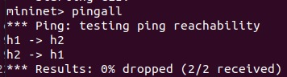
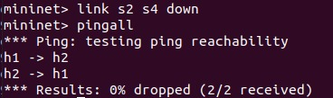
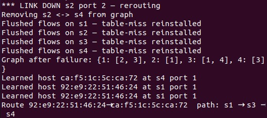
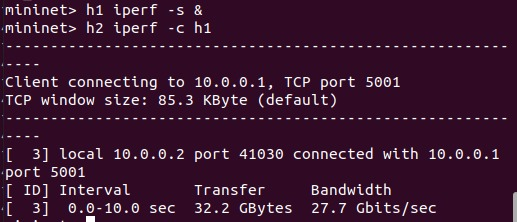
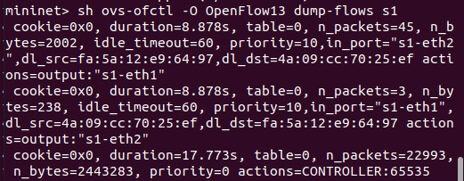
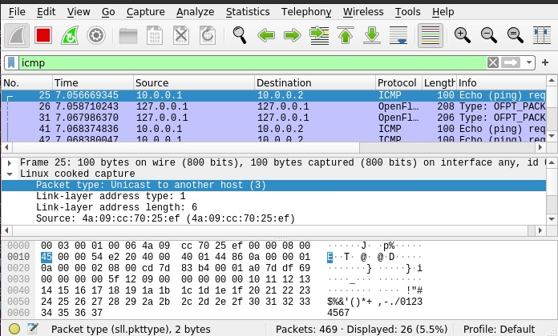
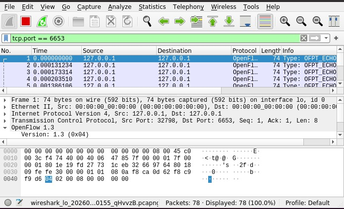

# Link Failure Detection and Recovery using SDN (Mininet + Ryu)

## 1. Problem Statement

This project implements an SDN-based network using Mininet and a Ryu OpenFlow controller to demonstrate:

- Controller–switch interaction
- Flow rule design using match–action logic
- Network behavior under normal and failure conditions

The system detects link failures and dynamically reroutes traffic using updated flow rules, ensuring continued connectivity.

---

## 2. Objective

- Detect link failures in the network
- Dynamically update routing using the controller
- Restore connectivity via alternate paths
- Demonstrate SDN behavior through flow rules and packet-level analysis

---

## 3. Topology Design

The network consists of:

- 4 switches: s1, s2, s3, s4  
- 2 hosts: h1, h2  

Topology:
```
h1 --- s1 --- s2 --- s4 --- h2
          \        /
           \      /
            s3 ---
```

### Key Feature:
- Two paths exist between h1 and h2:
  - Primary: s1 → s2 → s4  
  - Backup: s1 → s3 → s4  

This redundancy enables recovery after link failure.

---

## 4. Controller Logic (Ryu)

The controller performs the following:

- Handles `packet_in` events
- Learns host MAC-to-switch mapping
- Maintains a network graph of switches
- Computes shortest path using BFS
- Installs flow rules using match–action:
  - Match: `in_port`, `eth_src`, `eth_dst`
  - Action: output to correct port
- Detects link failure using `EventOFPPortStatus`
- Updates topology and recomputes paths
- Flushes old flow rules and installs new ones

---

## 5. Flow Rule Design

Flow rules are installed using OpenFlow:

- Priority-based rules
- Match fields:
  - Source MAC
  - Destination MAC
  - Input port
- Actions:
  - Output to next hop port

Example behavior:
- Traffic from h1 to h2 follows computed shortest path
- Reverse flows are also installed

---

## 6. Execution Steps

### Step 1: Start Controller

ryu-manager controller.py

### Step 2: Start Mininet

sudo mn --custom topology.py --topo mytopo --controller=remote --switch ovsk,protocols=OpenFlow13

---

## 7. Test Scenarios (Validation)

### Scenario 1: Normal Operation

pingall

- All hosts can communicate
- Packets follow primary path



---

### Scenario 2: Link Failure and Recovery

link s2 s4 down  
pingall

- Controller detects failure
- Graph is updated
- Alternate path is computed
- New flow rules are installed
- Traffic is rerouted via s1 → s3 → s4
- Connectivity is restored





---

## 8. Performance Observation

### Latency (Ping)

- Measured using `pingall`
- Low latency in normal condition
- Slight variation after rerouting

---

### Throughput (iperf)

h1 iperf -s &  
h2 iperf -c h1  

- High throughput observed
- Throughput remains stable after rerouting
- Note: Mininet uses virtual links, so bandwidth appears high



---

### Flow Table Analysis

sh ovs-ofctl -O OpenFlow13 dump-flows s1

- Flow entries dynamically installed
- Old flows removed after failure
- New flows reflect alternate path



---

### Packet Observation (Wireshark)

- ICMP packets show host-to-host communication
- OpenFlow packets show controller-switch interaction
- After failure, new OpenFlow messages confirm rerouting





---

## 9. Proof of Execution

The following outputs are included:

- Ping results (normal and failure)
- iperf throughput results
- Flow table entries
- Wireshark captures:
  - ICMP packets
  - OpenFlow messages
- Controller logs showing:
  - Link failure detection
  - Graph update
  - Rerouting

---

## 10. Functional Behavior

The project demonstrates:

- Forwarding using SDN controller
- Dynamic routing using flow rules
- Link failure detection
- Automatic traffic rerouting
- Controller-driven network behavior

---

## 11. Conclusion

This project successfully demonstrates SDN-based link failure detection and recovery using Mininet and Ryu.

The controller dynamically updates flow rules based on network conditions, ensuring uninterrupted communication through alternate paths.

---

## 12. References

- Ryu SDN Framework Documentation
- Mininet Documentation
- OpenFlow Specification

---

## 13. Expected Output

### Normal Operation
- pingall shows 0% packet loss
- Traffic flows through primary path (s1 → s2 → s4)

### After Link Failure
- Link s2–s4 is brought down
- Controller detects failure
- Flow tables are updated
- Traffic is rerouted via alternate path (s1 → s3 → s4)
- pingall still shows successful communication

### Throughput
- iperf shows successful data transfer between hosts
- Throughput remains stable after rerouting

### Packet Observation
- Wireshark shows ICMP packets between hosts
- OpenFlow messages indicate controller activity and flow updates